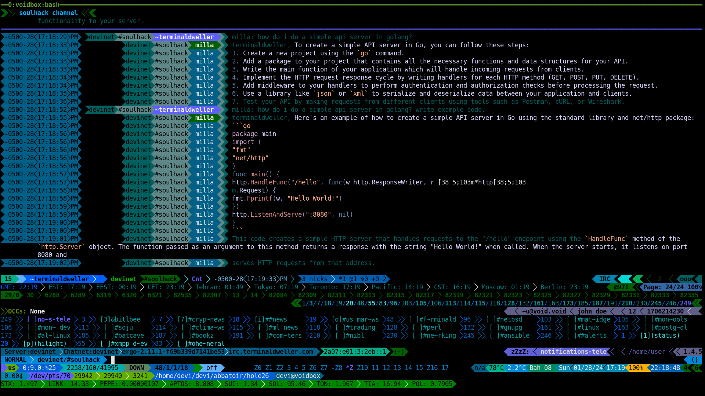

# milla

Milla is an IRC bot that sends things over to an LLM when you ask it questions and prints the answer with optional syntax-highlighting.<br/>
Milla can run more than one instance of itself, use different proxies(socks5 and http), connect to more than one IRC networks and log to different databases.<br/>
Currently supported providers:

- Ollama
- Openai
- Gemini



milla accepts one cli arg which tells it where to look for the config file:<br/>

```$ milla -help
Usage of ./milla:
  -config string
          path to the config file (default "./config.toml")
```

The bot will respond to chat prompts if they begin with `botnick:`.<br/>
The bot will see a chat prompt as a command if the message begins with `botnick: /`.<br/>

## Config

An example is provided under `config-example.toml`. Please note that all the config options are specific to one instance which is defined by `ircd.nameofyourinstance`.<br/>

#### ircServer

The address for the IRC server to connect to.

#### ircNick

The nick the bot should use.

#### enableSasl

Whether to use SASL for authentication.

#### ircSaslUser

The SASL username.

#### ircSaslPass

The SASL password for SASL plain authentication. Can also be passed as and environment variable.

#### ollamaEndpoint

The address for the Ollama chat endpoint.

#### model

The name of the model to use.

#### chromaStyle

The style to use for syntax highlighting done by [chroma](https://github.com/alecthomas/chroma). This is basically what's called a "theme".

#### chromaFormatter

The formatter to use. This tells chroma how to generate the color in the output. The supported options are:

- `noop` for no syntax highlighting
- `terminal` for 8-color terminals
- `terminal8` for 8-color terminals
- `terminal16` for 16-color terminals
- `terminal256` for 256-color terminals
- `terminal16m` for treucolor terminals
- `html` for HTML output

**_NOTE_**: please note that the terminal formatters will increase the size of the IRC event. Depending on the IRC server, this may or may not be a problem.

#### provider

Which LLM provider to use. The supported options are:

- [ollama](https://github.com/ollama/ollama)
- chatgpt
- gemini

#### apikey

The apikey to use for the LLM provider. Can also be passed as and environment variable.

#### ollamaSystem

The system message to use for ollama.

#### clientCertPath

The path to the client certificate to use for client cert authentication.

#### serverPass

The password to use for the IRC server the bot is trying to connect to if the server has a password. Can also be passed as and environment variable.

#### bind

Which address to bind to for the IRC server.

#### temp

The temperature to config the model with.

#### requestTimeout

The timeout for requests made to the LLM provider.

#### millaReconnectDelay

How much to wait before reconnecting to the IRC server.

#### ircPort

Which port to connect to for the IRC server.

#### keepAlive

#### memoryLimit

How many conversations to keep in memory for a model.

#### pingDelay

Ping delay for the IRC server.

#### pingTimeout

Ping timeout for the IRC server.

#### topP

#### topK

#### skipTLSVerify

Skip verifying the IRC server's TLS certificate. This only makes sense if you are trying to connect to an IRC server with a self-signed certificate.

#### useTLS

Whether to use TLS to connect to the IRC server. This option is provided to support usage on overlay networks such as Tor, i2p and [yggdrassil](https://github.com/yggdrasil-network/yggdrasil-go).

#### disableSTSFallback

Disables the "fallback" to a non-TLS connection if the strict transport policy expires and the first attempt to reconnect back to the TLS version fails.

#### allowFlood

Disable [girc](https://github.com/lrstanley/girc)'s built-in flood protection.

#### debug

Whether to enable debug logging. The logs are written to stdout.

#### out

Whether to write raw messages to stdout.

#### admins

List of adimns for the bot. Only admins can use commands.

```
admins = ["admin1", "admin2"]
```

#### ircChannels

List of channels for the bot to join when it connects to the server.

```
ircChannels = ["#channel1", "#channel2"]
```

### databaseUser

Name of the database user. Can also be passed an an environment variable.

### databasePassword

Password for the database user. Can also be passed an an environment variable.

### databaseAddress

Address of the database. Can also be passed as and environment variable.

### databaseName

Name of the database. Can also be passed as and environment variable.

### ircProxy

Determines which proxy to use to connect to the irc network:

```
ircProxy = "socks5://127.0.0.1:9050"
```

### llmProxy

Determines which proxy to use to connect to the LLM endpoint:

```
llmProxy = "socks5://127.0.0.1:9050"
```

### ircdName

Name of the milla instance, must be unique across all instances.

### adminOnly

Milla will only answer if the nick is in the admin list.

### webIRCGateway

webirc gateway to use.

### webIRCHostname

webirc hostname to use.

### webIRCPassword

webirc password to use.

### webIRCAddress

webirc address to use.

### Example Config File

```toml
[ircd.devinet]
ircServer = "irc.myawesomeircnet.com"
ircPort = 6697
ircNick = "milla"
enableSasl = true
ircSaslUser = "milla"
ircSaslPass = "xxxxx"
ircChannels = ["##chan1", "##chan2"]
temp = 0.2
requestTimeout = 10
millaReconnectDelay = 60
model = "gpt-3.5-turbo"
chromaStyle = "rose-pine-moon"
chromaFormatter = "terminal256"
provider = "chatgpt"
apikey = "xxxx"
memoryLimit = 20
admins = ["noone_has_this_nick"]
debug = true
out = true
databaseAddress = "postgres:5432"
databasePassword = "changeme"
databaseUser = "devi"
databaseName = "milla"
scrapeChannels = ["#soulhack", "#warroom"]
ircProxy = "socks5://127.0.0.1:9050"
llmProxy = "http://127.0.0.1:8180"
skipTLSVerify = false
useTLS = true

[ircd.liberanet]
ircServer = "irc.libera.chat"
ircNick = "milla"
model = "gpt-3.5-turbo"
ircPort = 6697
chromaStyle = "rose-pine-moon"
chromaFormatter = "terminal16m"
provider = "gemini"
apikey = "xxxx"
temp = 0.5
requestTimeout = 10
millaReconnectDelay = 60
keepAlive = 20
memoryLimit = 20
pingDelay = 20
pingTimeout = 600
skipTLSVerify = false
useTLS = true
disableSTSFallback = true
allowFlood = false
admins = ["noone_has_this_nick"]
ircChannels = ["##milla1", "##milla2"]
debug = true
out = true
ircProxy = "socks5://127.0.0.1:9051"
llmProxy = "http://127.0.0.1:8181"
```

## Commands

#### help

Prints the help message.

#### get

Get the value of a config option. Use the same name as the config file but capitalized: `/get chromaFormatter`

#### getall

Get the value of all config options.

#### set

Set a config option on the fly. Use the same name as the config file but capitalized: `/set chromaFormatter noop`

#### memstats

Returns memory stats for milla.

#### join

Joins a channel: `/join #channel`

#### leave

Leaves a channel: `/leave #channel`

## Deploy

### Docker

Images are automatically pushed to dockerhub. So you can get it from [there](https://hub.docker.com/r/terminaldweller/milla).
An example docker compose file is provided in the repo under `docker-compose.yaml`.
milla can be used with [gvisor](https://gvisor.dev/)'s docker runtime, `runsc`.

```yaml
services:
  milla:
    image: milla
    build:
      context: .
    deploy:
      resources:
        limits:
          memory: 64M
    logging:
      driver: "json-file"
      options:
        max-size: "100m"
    networks:
      - millanet
      user: ${UID}:${GID}
    restart: unless-stopped
    command: ["--config", "/opt/milla/config.toml"]
    volumes:
      - ./config-gpt.toml:/opt/milla/config.toml
      - /etc/localtime:/etc/localtime:ro
      - /etc/resolv.conf:/etc/resolv.conf:ro
    cap_drop:
      - ALL
    runtime: runsc
networks:
  millanet:
    driver: bridge
```

### Public Message Storage

milla can be configured to store all incoming public messages for future use in a postgres database. An example docker compose file is provided under `docker-compose-postgres.yaml`.<br/>

```yaml
services:
  terra:
    image: milla_distroless_vendored
    build:
      context: .
      dockerfile: ./Dockerfile_distroless_vendored
    deploy:
      resources:
        limits:
          memory: 128M
    logging:
      driver: "json-file"
      options:
        max-size: "100m"
    networks:
      - terranet
    user: 1000:1000
    restart: unless-stopped
    entrypoint: ["/usr/bin/milla"]
    command: ["--config", "/config.toml"]
    volumes:
      - ./config-gpt.toml:/config.toml
      - /etc/localtime:/etc/localtime:ro
    cap_drop:
      - ALL
    environment:
      - HTTPS_PROXY=http://172.17.0.1:8120
      - https_proxy=http://172.17.0.1:8120
      - HTTP_PROXY=http://172.17.0.1:8120
      - http_proxy=http://172.17.0.1:8120
  postgres:
    image: postgres:16-alpine3.19
    deploy:
      resources:
        limits:
          memory: 4096M
    logging:
      driver: "json-file"
      options:
        max-size: "200m"
    restart: unless-stopped
    ports:
      - "127.0.0.1:5455:5432/tcp"
    volumes:
      - terra_postgres_vault:/var/lib/postgresql/data
      - ./scripts/:/docker-entrypoint-initdb.d/:ro
    environment:
      - POSTGRES_PASSWORD_FILE=/run/secrets/pg_pass_secret
      - POSTGRES_USER_FILE=/run/secrets/pg_user_secret
      - POSTGRES_INITDB_ARGS_FILE=/run/secrets/pg_initdb_args_secret
      - POSTGRES_DB_FILE=/run/secrets/pg_db_secret
    networks:
      - terranet
      - dbnet
    secrets:
      - pg_pass_secret
      - pg_user_secret
      - pg_initdb_args_secret
      - pg_db_secret
    runtime: runsc
  pgadmin:
    image: dpage/pgadmin4:8.6
    deploy:
      resources:
        limits:
          memory: 1024M
    logging:
      driver: "json-file"
      options:
        max-size: "100m"
    environment:
      - PGADMIN_LISTEN_PORT=${PGADMIN_LISTEN_PORT:-5050}
      - PGADMIN_DEFAULT_EMAIL=${PGADMIN_DEFAULT_EMAIL:-devi@terminaldweller.com}
      - PGADMIN_DEFAULT_PASSWORD_FILE=/run/secrets/pgadmin_pass
      - PGADMIN_DISABLE_POSTFIX=${PGADMIN_DISABLE_POSTFIX:-YES}
    ports:
      - "127.0.0.1:5050:5050/tcp"
    restart: unless-stopped
    volumes:
      - terra_pgadmin_vault:/var/lib/pgadmin
    networks:
      - dbnet
    secrets:
      - pgadmin_pass
networks:
  terranet:
    driver: bridge
  dbnet:
volumes:
  terra_postgres_vault:
  terra_pgadmin_vault:
secrets:
  pg_pass_secret:
    file: ./pg/pg_pass_secret
  pg_user_secret:
    file: ./pg/pg_user_secret
  pg_initdb_args_secret:
    file: ./pg/pg_initdb_args_secret
  pg_db_secret:
    file: ./pg/pg_db_secret
  pgadmin_pass:
    file: ./pgadmin/pgadmin_pass
```

The env vars `UID`and `GID`need to be defined or they can replaces by your host user's uid and gid.<br/>

As a convenience, there is a a [distroless](https://github.com/GoogleContainerTools/distroless) dockerfile, `Dockerfile_distroless` also provided.<br/>
A vendored build of milla is available by first running `go mod vendor` and then using the provided Dockerfile, `Dockerfile_distroless_vendored`.<br/>

### Build

For a regular build:

```sh
go mod download
go build
```

For a vendored build:

```sh
go mod vendor
go build
```

## FAQ

- I end up with color escape sequences getting printed at the end of a line/begging of the next line. what gives?
  This is happening because you have reached the message limit on irc which 512 for the event. This practically leaves around 390-400 character left for the message itself. Certain ircds allow for bigger sizes and certain clients might do. But most ircds dont send `linelen` to the clients. In a closed-loop situation where you control everything, as in, the ircd and all the clients(i.e. a private irc network), you can try to increase the linelen for the ircd and the client. Please note that the client in this case is girc. You irc client can have its own set of limits too. The 512 limit is hardcoded in girc. You can vendor the build or use the vendored dockerfile, change the hard limit and run milla with an increased limit. Needless to say, you can try to use a chromaFormatter that produces less characters which is basically not using treucolor or `terminal16m`.

## Thanks

- [girc](https://github.com/lrstanley/girc)
- [chroma](https://github.com/alecthomas/chroma)
- [pgx](https://github.com/jackc/pgx)
- [ollama](https://github.com/ollama/ollama)

## Similar Projects

- [soulshack](https://github.com/pkdindustries/soulshack)
